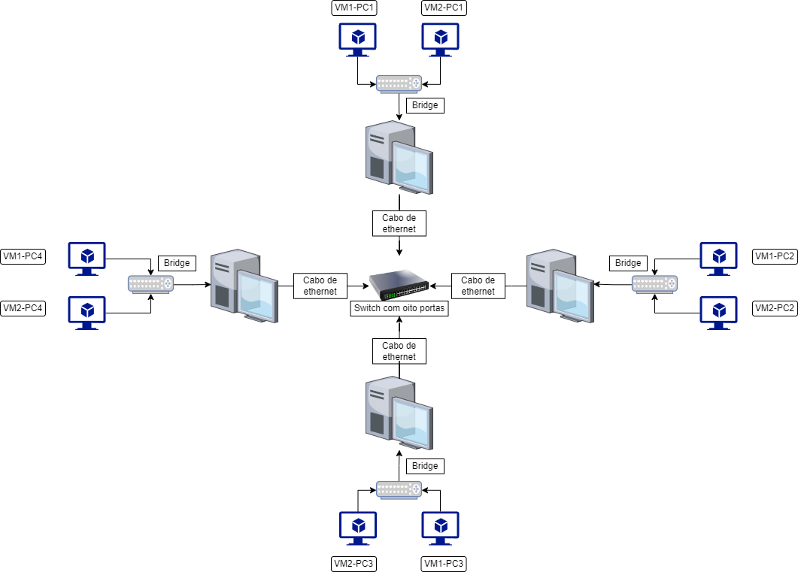

# CRIAÇÃO DE UMA REDE VIRTUAL COM O UBUNTU SERVER

Com o objetivo de colocar em prática os conhecimentos adquiridos ao longo das matérias de redes de computadores (PIRD e SERD), este roteiro detalha os procedimentos necessários para a criação de um ambiente de rede com 8 máquinas virtuais com o Ubuntu Server. 

# Sumário

### Introdução
* Descrição do projeto
* Configurações de hardware
* Topologia da rede
* Organização dos IPs

### Máquinas virtuais
 * Criação das VMs
 * Configuração dos IPs
 * Configuração dos hostnames

### SSH e firewall

### Nomes estáticos 
 * Configuração dos nomes estáticos
 * Adiocionando usuários

### Conexão entre as máquinas

### Testes
 * PINGs
 * SSH

### Considerações finais
#

# Introdução

### Descrição do projeto

Com o objetivo de colocar em prática os conhecimentos adquiridos ao longo das matérias de redes de computadores, este roteiro detalha os procedimentos necessários para a criação de um ambiente de rede com 8 máquinas virtuais (VM), que utilizam o Sistema Operacionl Ubuntu Server. Para isso, serão utilizados 4 computadores do laboratório de redes, que devem se conectar através de um switch, para resultar em servidores conectados em um mesma rede e com acesso remoto através do ssh.

### Configurações de hardware		

As máquinas virtuais devem ser criadas seguindo os especificações abaixo:
* memória
* bla
* bla

Figura 1: Configuração de hardware das VMs
*FOTO DAS CONFIGURAÇÕES DE HARDWARE AQUI*

### Topologia da rede

 A topologia que utilizamos foi a do tipo estrela, nesse modelo existe um HUB central, no nosso caso um switch, que faz o gerenciamento dos dados que passam pela rede, por causa disso é nescessário que para a rede funcionar todas as máquinas devem estar conectadas ao switch por cabo de rede. Sendo assim também os dados não passam por todas as máquinas, mas somento pela qual o dado está endereçado.
 
<p><center> Figura 2: Topologia estrela</center></p>   


 
### Organização dos IPs

Para melhor organização das máquinas, as organizaremos em uma tabela com suas descrições, IPs, Hostnames, FQDNs e aliases, seguindo o seguinte padrão:
- Descrição:
- IP: ` 192.168.24.[i] `
  - [ i ] varia entre 99 e 105
- Hostname: `grupo7-vm[x]-pc[y]` 
  - [ x ] varia entre 1 e 2
  - [ y ] varia entre 1 e 4 
- FQDN: `[nome] grupo7-924.ifalara.net`
- Aliase: 3 primeiras letras dos nomes e sobrenomes dos integrantes do grupo

Tabela 1: Definições de endereços IPs da Rede e Nomes de Hosts

|  DESCRIÇÃO       |       IP        |      HOSTNAME     |          FQDN                      |     ALIASE       |
|------------------|-----------------|-------------------|------------------------------------|------------------|
| VM1-PC1          | 192.168.24.98   |   grupo7-vm1-pc1  | alan.grupo7-924.ifalara.net        | ala              |               
| VM2-PC1          | 192.168.24.99   |   grupo7-vm2-pc1  | barbosa.grupo7-924.ifalara.net     | bab              |
| VM1-PC2          | 192.168.24.100  |   grupo7-vm1-pc2  | isadora.grupo7-924.ifalara.net     | isa              |                
| VM2-PC2          | 192.168.24.101  |   grupo7-vm2-pc2  | macedo.grupo7-924.ifalara.net      | mac              |
| VM1-PC3          | 192.168.24.102  |   grupo7-vm1-pc3  | thiago.grupo7-924.ifalara.net      | thi              |
| VM2-PC3          | 192.168.24.103  |   grupo7-vm2-pc3  | almeida.grupo7-924.ifalara.net     | alm              |
| VM1-PC4          | 192.168.24.104  |   grupo7-vm1-pc4  | janjan.grupo7-924.ifalara.net      | jan              |
| VM2-PC4          | 192.168.24.105  |   grupo7-vm2-pc4  | silva.grupo7-924.ifalara.net       | sil              |

# Máquinas Virtuais

## Criação das VMs

1. O primeiro passo consiste na criação de uma pasta para salvar as VMs. Em nosso caso, a pasta criada foi “924-grupo7” dentro da pasta “VM” de “labredes”.

Figura 3: Pasta do grupo


2. Em seguida, abrimos o virtualbox e criamos duas máquinas virtuais, seguindo os padrões de hardware já comentados anteriormente.  A criação das máquinas consiste em:
    - Importar o appliance, que está salvo na subpasta “images” da pasta “labredes”.
     
    `Arquivo > importar appliance `
    
    Figura 4: Importação do appliance
    

    - Mudar o nome da VM, seguindo o padrão da tabela;
    - Mudar a pasta padrão para a pasta que foi criada.

Figura 5: Criação da VM


Com as VMs já criadas, é necessário fazer login como administrador:
` Login: administrador
| Senha: adminifal `

3. Depois é necessário fazer a **instalação do pacote net-tools** para que tudo funcione corretamente. O comando que a ser utilizado é:

```shell
sudo apt-get install net-tools
```
Figura 6: Instalação do pacote net-tools
![login feito ]


## Configuração dos IPs

Após logar nas VMs:

1. Primeiro é necessário verificar o nome do arquivo netplan, digitando o comando:
```shell
ls -la /etc/netplan
```
  
2. Acesse o arquivo .YAML
```shell
sudo nano /etc/netplan/01-netcfg.yaml
```
   >A saída que foi dada ao digitar o primeiro comando será utilizada para acessar o arquivo, sendo digitada depois de `netplan/`.

3. Ao abrir o arquivo, ele apresentará as seguintes configurações:
 
 ```shell
network:
  ethernets:
    enp0os3:
      dhcp4: true
  version: 2
```
   - Primeiro, insira os campos `addresses` e `gateway4` dentro de `enp0os3`.
   - Depois, desative o dhcp4, mudando o seu valor para false.
  >Para sair desta parte digite Ctrl+x, depois y e aperte enter

Para aplicar efetivamente as mudanças, digite o comando:

```shell
sudo netplan apply
```
>Sempre que fizer alguma alteração nesse arquivo, esse comando deverá ser digitado para aplicar a mudança.

Ao final dessa etapa o arquivo `.YAML` deverá estar assim:

Figura 7: Configuração do IP


>A identação correta é de extrema importância nessa etapa. Para que não ocorra nenhum erro, utilize a tecla espaço para realizar essa ação, e não a tecla tab.

* Para visualizar se as mudanças foram efetivadas, digite o comando:

```shell
ifconfig -a
```

## Configuração dos hostnames

O próximo passo é adicionar os hostnames em cada VM, de acordo com a tabela 1. Isso deve ser realizado através do comando:

```shell
sudo hostnamectl set-hostname <hostname>
```
Figura 8: Configuração do Hostname

![atribuindo nomes aos servidores hostname]


# SSH e firewall

Agora iniciamos o processo de preparação para a instalação do servidor ssh. 

1. Novamente digite o comando `sudo nano /etc/netplan/01-netcfg.yaml`

- Ao abrir o arquivo você deverá:
  - Comentar a linha de IP
  - Comentar a linha de gateway4
  - Reativar o dhcp (true)

Figura 9

![comentando as linhas IP e ativando o dhcp nas configurações do netplan]


 - Deverá, também, trocar a configuração de rede do adaptador 1 para NAT.

2. Posteriormente, é necessário atualizar os pacotes com as novas definições e versões do repositório do Ubuntu, utilizando os comandos:

```shell
sudo apt update
```

```shell
sudo apt upgrade -y
```
Figura 10


Após a finalização dessa etapa, nós iniciamos a instalação do servidor servidor ssh. 

1. Digite:
```shell
systemctl status ssh
``` 
 - verificamos que o shh estava inativo, então é necessário que ele seja instalado. Desse modo, utilizamos o comando:

```shell
sudo apt-get install openssh-server
```
Figura 11

![VirtualBox_VM1-PC3_25_08_2022_09_48_15]


>Você pode digitar novamente o primeiro comando para se certificar que está tudo certo.

2. Após a instação do ssh é necessário ajustar o firewall, a fim de permitir conexões remotas. Para ajustá-lo digite:

```shell
sudo ufw allow ssh
sudo ufw enable
```
Figura 12

![ativando o firewall]


- Ao final desse processo você deve descomentar as linhas de ip e getway4, e também desativar o dhcp.
> Lembre-se que para que essas mudanças sejam efetivas, você deve digitar `sudo netplan apply`


# Nomes estáticos 

1. Para configurar os nomes estáticos digite o comando:

```shell
sudo nano /etc/hosts
```

2. Utilizando a tabela 1, modifque o arquivo hosts.

Figura 13


### Usuários

- Agora, é necessário adicionar 4 usuários iguais em todas as VMs. Para melhor organização, você pode criar uma tabela.

|  Usuário         |  
|------------------|
| alan             | 
| isadora          | 
| thiago           | 
| janjan           | 

  - O comando para adicionar os usuários é:

```shell
 sudo adduser <usuário>
```
Figura 14
![adicionando users]


# Fazendo a conexão entre as máquinas

1. Mudar as configurações de rede do adaptador 1 para `Placa em modo Bridge`.

2. Conectar o cabo ethernet dos computadores ao switch de 8 portas.

Figura 15: Switch de 8 portas 


Figura 16:  Cabos ethernet conectados ao switch


Figura 17: Rede formada pelos 4 PCs


3. Logar em outra VM da rede utilizando o comando:
     ```shell
     ssh <usuario>@<ip>
     ```
    
# Testes

Depois de seguir todos os passos acima, a última etapa do projeto é testar e verificar se tudo está funcionando corretamente. Para realizar essa verificação, utilizaremos dois tipos de teste: Ping e teste de SSH

### PING
Para esse tipo de teste serão utilizados respectivamente os IPs, hostnames, FQDNs e aliases (tabela 1).

Figura 18:


Figura 19:


### SSH


Figura 20: 


# Considerações finais
